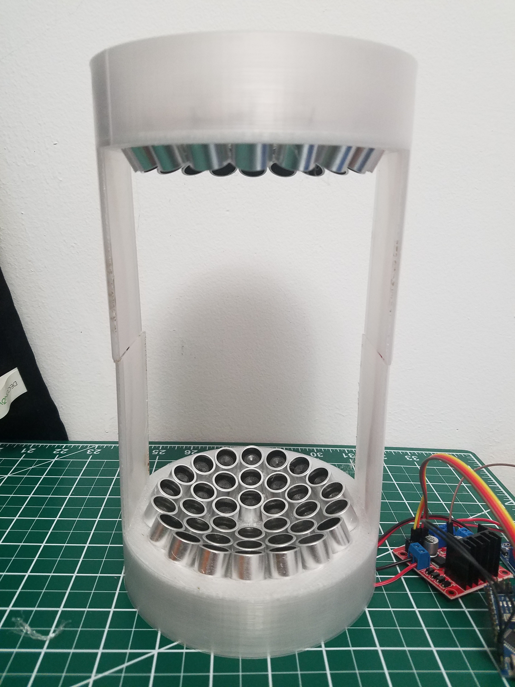
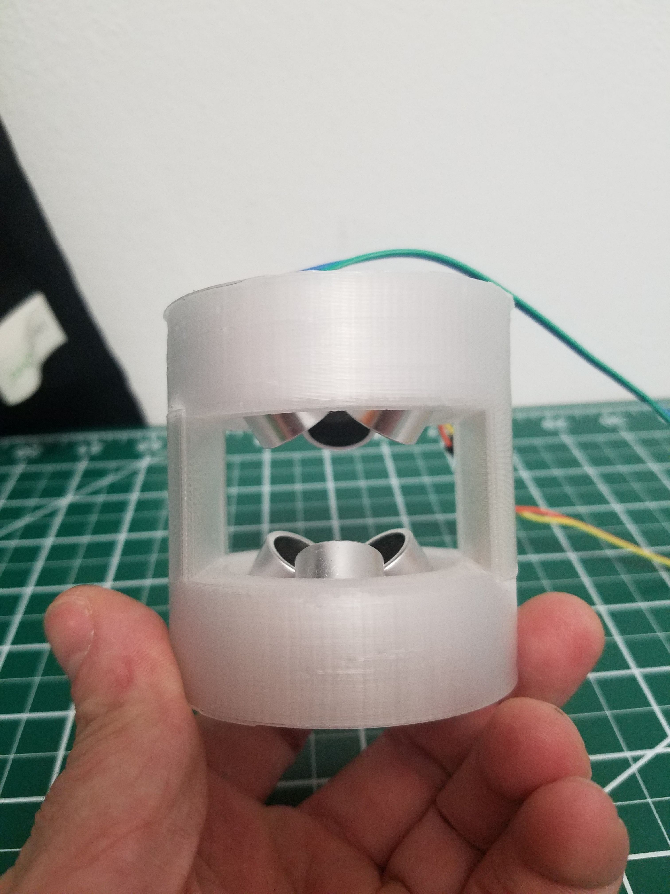
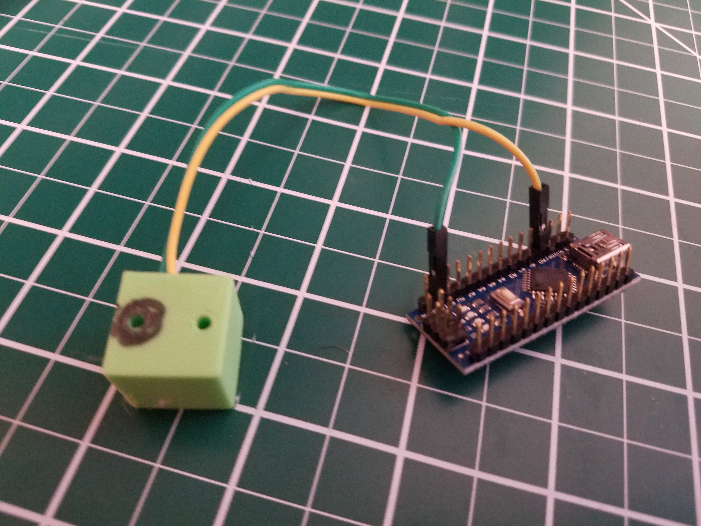

# ParametricLev, A Parametric Acoustic Levitation Device

After coming across the Instructables for [acoustic levitators](https://www.instructables.com/id/Acoustic-Levitator/) and [tractor beams](https://www.instructables.com/id/Acoustic-Tractor-Beam/) from UpnaLab, I was determined to make my own. I wanted a little more control over how the device looked, so I set about making a parametric version. Generating a new enclosure still has some manual tweaking, but it's much easier now!

# Acoustic Levitation?

I encourage you to explore the instructables linked above, but the tl;dr of acoustic levitation is by manipulating sound waves high enough that the human ear can't hear them, you can create high pressure and low pressure pockets that will force objects to move in a predictable pattern. In our case, we are setting up two transducer arrays in direct opposition to each other, creating a standing wave that will allow us to place objects at the nodes.

# Differences from the original design

## BigLev

Like BigLev in the instructable, I ended up going with 16mm transducers, since they are more powerful and they were also cheaper than any 12mm transducers I could find. I bought 8 of [these](https://www.amazon.com/gp/product/B01FDGTXT4/ref=oh_aui_detailpage_o00_s00?ie=UTF8&psc=1) for ~$8 a pop, for a total of 80 transducers. If you so desire, this allows you to build a BigLev, a MicroLev, and a NanoLev (72 + 6 + 2).

The original acoustic levitation instructable has you order a power supply that can discretely switch between voltages. This works well, but my transducers support up to 30 volts, so I ended up using the variable step-up transformer from the tractor beam instructable. 30 volts is overkill for most applications (since voltage is mostly related to how dense a material you can levitate) but being able to precisely tune the voltage level is great for getting things to stay stable.

## MicroLev

MicroLev isn't featured in the original isntructable, but I wanted something simpler to test the wiring on before scaling all the way up. 6 transducers is a little hard for the nano to drive, so it can just barely levitate styrofoam without a motor controller. You might be able to increase this power by hooking up each transducer to a different pin and modifying the code, since you won't be reliant on the current output of a single pin to drive the transducers, but remember that arduino pins are connected to buses which themselves have a max current draw, so you'll have to be crafty about it. You can sidestep all of this however and just wire the MicroLev like you would the BigLev here or in the original instructable, allowing you to levitate popcorn pieces and probably a few other things.

## NanoLev

the NanoLev is a tiny WIP enclosure for the two-transducer device from the instructable. You'll have to find something to support the Nano, but it works ok!

# How to assemble

This is only a list of the changes to the instructions and gotchas I encountered, so please reference the original instructable while you assemble the design. I may write up a full build log later, but as it stands the differences are pretty minimal

## BOM

* l298N, https://www.amazon.com/gp/product/B01CC8XI60/
* Arduino nano, https://www.amazon.com/gp/product/B00Q9YBO88/
* DC/DC Voltage Transformer, https://www.amazon.com/gp/product/B00J03PBW0
* 12V 3A wall wart, https://www.amazon.com/gp/product/B07CWVFGNN
* 72 16mm 40khz transducers, https://www.amazon.com/gp/product/B01FDGTXT4/
* bare copper wire, https://www.amazon.com/gp/product/B00E4WL2D4/
* black/red wire, https://www.amazon.com/gp/product/B009VCZ4V8/
* barrel connector, https://www.amazon.com/gp/product/B00T7VOKM2/

## Printing

for the __BigLev__, print two halves, with support. for the __MicroLev__ you need to print the top and bottom; the files come from an earlier design where opposing sides slotted together that unfortunately didn't fit on my 3d printer when scaling up to the BigLev. For the NanoLev, just print the one file; it's a completely different setup than the other designs.

There are some nasty overhangs in the BigLev and MicroLev prints, so make sure you print in whatever material gives you the best overhang performance.

## Transducers

DO NOT SKIP MARKING YOUR TRANSDUCERS. Despite most transducers having a marked 'ground' wire it does NOT correlate to polarity. For most applications this does not matter, but in our case if you place two transducers with opposite polarity next to each other they will destructively interfere, decreasing the power of your device. The direction of the polarity doesn't actually matter, but what _does_ matter is that all transducers are wired the same. I placed the marked leg towards the center, just like the instructable. I created a jig for testing the polarity, which you can glue wires into to make it easier to connect the transducer to the arduino:

Most transducers come in pairs; one transducer is for transmitting waves and the other for receiving. Transmitters are tuned to produce waves based on electrical input, whereas receivers are tuned to produce electrical input based on sounds. While this _sounds_ bad for us, since we are only interested in producing waves, receivers and transmitters can be used interchangeably with a small loss in efficiency. If you can find a source of only transmitters (or transceivers, which are a compromise between the two) by all means, but it really isn't worth any extra money. For peace of mind, I separated my transmitters and receivers and alternated between them when I placed them in the enclosure, so that I wouldn't accidentally place a large amount of them on either half.

## Wiring

I will get better pictures for this later, I promise.

You can by all means follow the original wiring in the instructable, but if you want to use the step-up transformer you'll have to make a few modifications. Wire the actual device as they do in the instructable, and wire it to the l298N driver as they do as well. Since we'll be far exceeding the 12V the controller needs to run its own logic, we'll need to patch in 12V from the wall wart and tell the controller to use that for logic instead of the input voltage. This means you need to take off the jumper, and attach a wire from 12V in it's place. See the brown wire in this picture:

It is VERY IMPORTANT to put this wire in the correct place, otherwise you might damage the controller or start a fire.

Instead of feeding in electricity directly from the wall wart, the input to the controller comes from the step-up transformer, as you can see in the picture.

The arduino Nano can't handle the voltage we'll be pumping into the controller, so we'll also need to run wires from the barrel connector to the arduino's VIN and GND pins. Otherwise, the wiring is the same as the instructable. Picture reference:

after all is said and done, the wiring should look like this:

except not as messy

## Programming

Programming on the arduino is exactly the same as in the instructable, just grab their .ino file and use it.

Of note is that an arduino nano is pretty overkill for this application, since all it's doing is creating a 40KHZ signal. The arduino could be replaced by a clock and crystal and some power management circuitry by someone more electrically inclined than I am.

## Using

I find it easiest to use teabag material to place objects, though any sonically transparent material would work fine (wire mesh is probably the best). If your item is spinning rapidly it's an indication that the standing wave is too intense for its density; try decreasing the voltage on the transformer until it slows down.

If you have a resin printer (or are ok with paying Shapeways 7.50 per part), you can get extremely tiny 3d printed models to levitate. The size of the object that can be levitated is a function of half the wavelength, so anything more than ~4.5mm in diameter is too large. Luckily that's just above the minimum size requirements for Shapeways.

## Spacing

I have noticed with my current design that I can get some nasty resonance in the exact middle spot, causing pieces to fall despite them levitating just fine in other spots. I've noticed that changing the distance between the pieces makes this go away, so I think it's a function of the radius of the internal sphere being a multiple, or perhaps an odd multiple, of half the wavelength. I've increased the multiple to 22 but haven't actually tested it yet. If you have similar problems though, you could easily print a tiny piece of the side sponsons and glue it in place, increasing the height. I've included an example shunt in the models directory, but the height of the shunt is probably better found through experimentation.

# Modifying

If you want to use a different amount of transducers or change parameters, you can clone this repository and open up `BigLev.scad` and `src/settings.scad` in OpenSCAD or whatever editor you choose. By modifying variables in `settings.scad`, you can generate a different shape.

The amount of transducers is a function of the area of the section of the sphere generated based off some napkin trig, so if you're looking for a specific amount of transducers you'll have to play around a bit (or you can try refactoring the old code in OldStuff.scad to manually control how many transducers there are). The napkin trig isn't perfect, so sometimes in order to eliminate dead space you'll have to dig into `transducers_for()` in `lev.scad` to get a more fine-tuned result. Still though, the algorithm produces good results for most cases.

## TODO

* Get better pictures!
* design a top / bottom
* refactor to allow for manual transducer placement
* refactor to allow for slop adjustments
